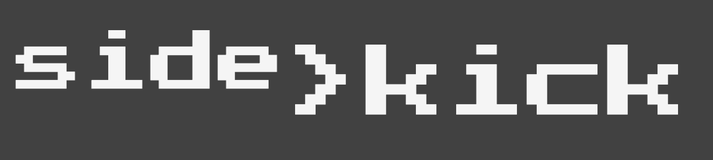

## I'm currently working on:

 

Semi-Pong game with silly balls and no way to lose the game.

[See this](https://projects.romeinvanburen.nl) for a longer list of projects I'm
(not) maintaining.

## Languages

## Frameworks & libraries

## Boards

<!--
## Activity

-->
